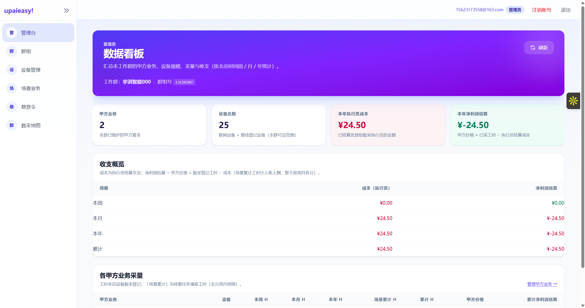
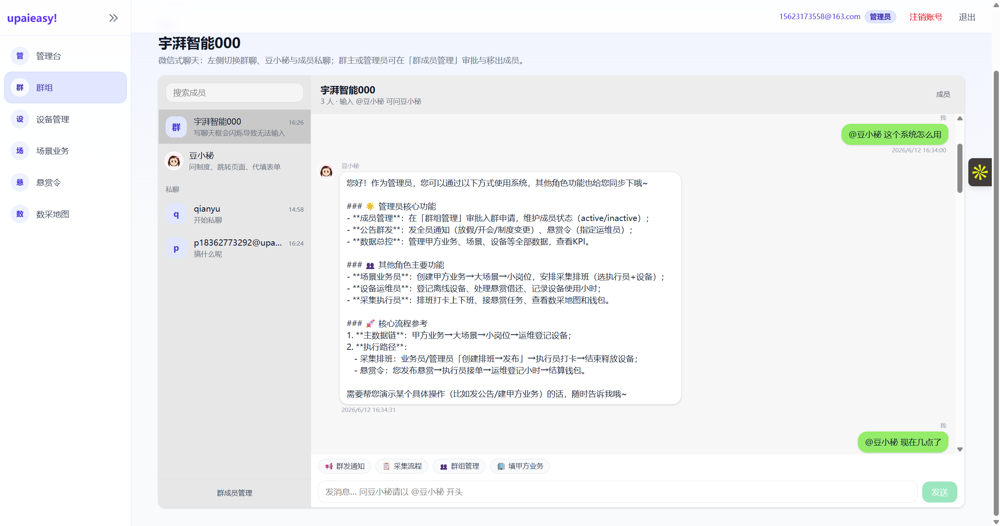
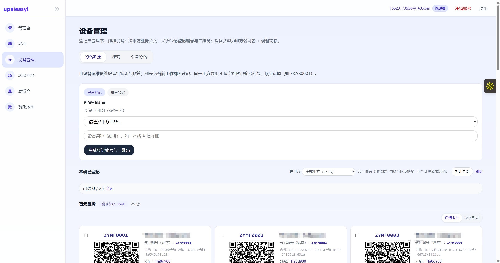
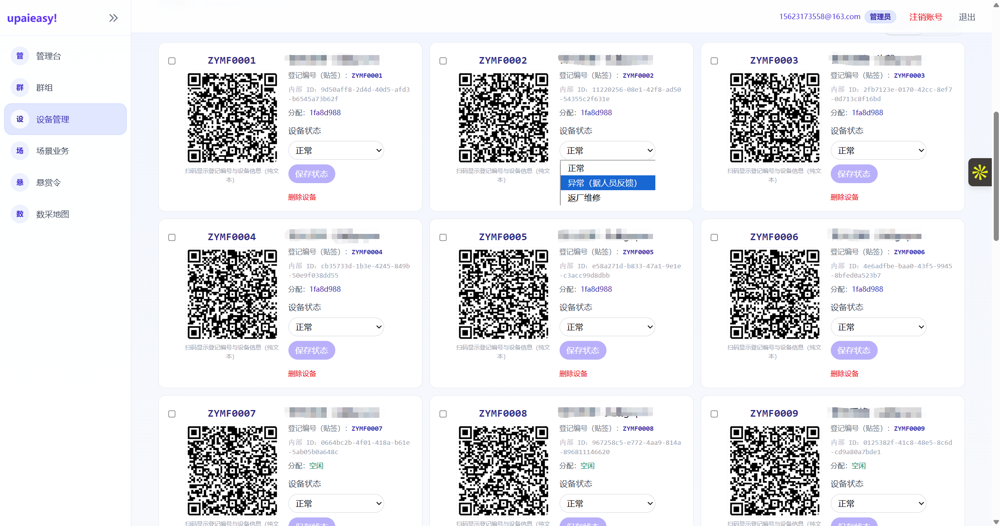
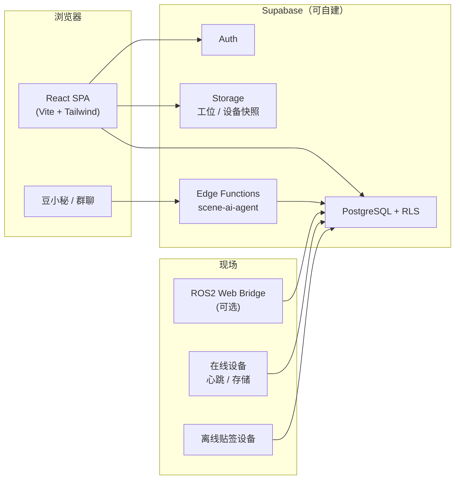

# upaieasy!

**数采一站式管理平台** — 把设备、场景、排班、结算和 AI 助手装进一个浏览器。

[](https://upaieasy.cn)
[](https://react.dev/)
[](https://www.typescriptlang.org/)
[](https://supabase.com/)
[](https://vite.dev/)
[](https://tailwindcss.com/)

> **在线地址：** [https://upaieasy.cn](https://upaieasy.cn)  
> 面向机器人 / 具身智能数采团队：**从设备贴签、现场排班到执行打卡、工时结算**，一条链路跑通。

---

## 产品预览

<p align="center">
  <a href="https://upaieasy.cn"></a>
</p>

<p align="center"><sub>管理员数据看板 — 甲方业务、设备规模与财务估算一屏汇总</sub></p>

<table>
  <tr>
    <td width="50%" align="center"><b>登录 · 多职能注册</b><br><sub>入群码 + 管理员 / 运维 / 场景 / 执行员</sub><br><br><a href="https://upaieasy.cn"></a></td>
    <td width="50%" align="center"><b>群组 · 豆小秘</b><br><sub>@ 机器人导航、代填表单、流程问答</sub><br><br><a href="https://upaieasy.cn"></a></td>
  </tr>
  <tr>
    <td width="50%" align="center"><b>设备登记 · 贴签二维码</b><br><sub>关联甲方业务，自动生成登记编号</sub><br><br><a href="https://upaieasy.cn"></a></td>
    <td width="50%" align="center"><b>设备卡片 · 状态维护</b><br><sub>分配执行员、扫码信息、异常 / 返厂</sub><br><br><a href="https://upaieasy.cn"></a></td>
  </tr>
</table>

<p align="center">
  <a href="https://upaieasy.cn"><strong>→ 前往 upaieasy.cn 体验</strong></a>
</p>

---

## 为什么选 upaieasy!

| 痛点 | upaieasy! 的做法 |
|------|------------------|
| 设备分散在 Excel、群聊和纸质贴签里 | 在线设备 + 离线设备统一登记，**二维码贴签**，心跳与校准状态一屏总览 |
| 甲方需求、场景、排班各用各的表 | **大场景 → 小岗位 → 采集排班** 层级清晰，发布即分配设备编号 |
| 执行员不知道今天去哪、用哪台机 | 执行员只看**分配给自己的设备**与排班，支持上下班打卡 |
| 管理员算不清工时和收入 | 管理台 **KPI + 财务估算**（甲方单价 × 工时 − 执行员成本） |
| 培训成本高、表单填错多 | 群内 **AI 助手（豆小秘）** 代填甲方业务、大场景、排班等表单 |

**开箱即用：** React 单页应用 + Supabase（Postgres / Auth / RLS / Storage / Edge Functions），无需自写后端业务 API。  
**可私有化部署：** 支持自建 Supabase（Docker on CVM），数据留在你的服务器。

---

## 核心能力

### 设备管理
- **在线设备**：注册、心跳、校准、固件与备注；设备二维码扫码识别
- **离线 / 外部设备**：关联甲方业务，生成 **10 位 hex 登记编号** 与贴签二维码
- **批量分配**：运维将空闲设备分配给数采执行员；执行员总览**仅可见已分配设备**

### 场景与排班
- **甲方业务**（管理员）：设备类型、快照、总小时量、**按大场景批复小时**、结算单价
- **场景岗位**：大场景（全景图 + 地址联系人）→ 小岗位（工位快照）
- **采集排班**：选岗位 + 执行员 + 设备数 → 发布 → 自动匀出离线设备编号 → 执行员打卡

### 协作与激励
- **工作群组**：入群码审批、成员多职能、群内话题
- **悬赏令**：管理员发布工时池，执行员领取
- **钱包与结算**：执行员侧流水与积分体系（与悬赏 / 结算 RPC 联动）

### 管理台
- 分角色 **KPI**（设备完好率 / 场景数 / 数据量）与考核周期
- **全员公告**、**财务估算看板**（按甲方拆分）

### AI 助手
- Supabase Edge Function `scene-ai-agent` + 前端 **豆小秘**
- 群聊 @ 机器人：导航、代填表单、业务流程问答（权限与角色对齐）

---

## 多角色，一个平台

权限为 `profiles.roles[]` **并集**；支持一人身兼多职（如运维 + 场景）。

| 职能 | 典型能力 |
|------|----------|
| **平台管理员** | 管理台、群组、甲方业务、全量设备、悬赏发布、财务看板 |
| **设备运维员** | 设备总览 / 管理、离线设备登记与分配、运维工作台 |
| **场景业务员** | 采集排班、大场景与小岗位维护 |
| **数采执行员** | 采集排班打卡、已分配设备只读总览、悬赏、钱包 |

详细交互说明见 **[网页使用手册](docs/网页使用手册.md)**。

---

## 架构一览



| 目录 | 说明 |
|------|------|
| [`frontend/`](frontend/) | **主产品**：React 19 + TypeScript + Tailwind 4 |
| [`supabase/functions/`](supabase/functions/) | Edge Functions（场景 AI 等） |
| [`docs/`](docs/) | 用户与运维文档 |
| [`backend/`](backend/) | 可选 FastAPI + CLI（USB 注册 /  provisioning） |
| [`board/`](board/) | 可选 ROS 2 → HTTPS 心跳桥接 |

---

## 快速开始

### 1. 连接 Supabase

生产库已在 **CVM 自建 Supabase** 上就绪，见 **[自建 Supabase 连接说明](docs/自建Supabase服务器连接说明.md)**（API 地址、`ANON_KEY`、禁止连官方云）。

### 2. 启动前端

```bash
cd frontend
npm install
cp .env.example .env
# 编辑 VITE_SUPABASE_URL、VITE_SUPABASE_ANON_KEY（仅 anon key，勿泄露 service_role）
npm run dev
```

浏览器打开 `http://localhost:5173`。首个用户可在 `profiles` 中设为 `admin`，或使用注册页的「平台管理员」入口（视部署策略而定）。

### 3. 可选：Edge Function（AI 助手）

```bash
# 见 scripts/server/deploy_scene_ai_agent.sh；密钥配置见 docs/自建Supabase服务器连接说明.md §6
bash scripts/server/deploy_scene_ai_agent.sh
```

### 4. 可选：设备 CLI / 板端

```bash
cd backend
pip install -r requirements.txt
python cli.py provision --port /dev/ttyUSB0   # Linux；Windows 用 COM 口
```

板端 ROS 2 桥接见 [`board/README.md`](board/README.md)。

---

## 文档索引

| 文档 | 读者 | 内容 |
|------|------|------|
| [网页使用手册](docs/网页使用手册.md) | 终端用户 | 按角色与页面的操作说明 |
| [自建 Supabase 服务器连接说明](docs/自建Supabase服务器连接说明.md) | 运维 / 开发 | 生产 CVM、密钥、SQL、Edge Function |
| [board/README.md](board/README.md) | 嵌入式 | ROS 2 Web Bridge 板端心跳 |

---

## 技术栈

- **前端：** React 19 · React Router 7 · TypeScript · Vite 7 · Tailwind CSS 4
- **后端数据：** Supabase（PostgREST · GoTrue · Row Level Security · Storage）
- **地图：** 高德 JS API（数采地图，可按环境开关）
- **AI：** 火山方舟 / 豆包（Edge Function 可配置）
- **设备侧：** Python FastAPI · ROS 2 Web Bridge · USB 串口 provisioning CLI

---

## 开发与测试

```bash
# 前端
cd frontend && npm run build && npm run lint

# 后端（可选）
cd backend && python -m pytest tests/ -v

# 交付抽检脚本（在 CVM 上）
bash scripts/server/delivery_test_verify.sh
bash scripts/server/run_delivery_test_rls.sh
```

---

## 项目结构

```
upaiego-management/
├── frontend/                 # Web 应用（主入口）
│   ├── src/pages/            # 设备、场景、排班、管理台、悬赏…
│   ├── src/api/              # Supabase 客户端封装
│   ├── src/aitebot/          # 豆小秘上下文与表单推断
│   └── edgeone.json          # 静态托管构建配置
├── supabase/functions/       # Edge Functions
├── docs/                     # 用户与运维文档
├── backend/                  # FastAPI + CLI（可选）
├── board/ros2_web_bridge/    # 板端心跳（可选）
└── scripts/server/           # 部署与验收脚本
```

---

## 关于

**upaieasy!** 聚焦具身智能与机器人数据采集的现场运营。

**官网：** [https://upaieasy.cn](https://upaieasy.cn)

---

<p align="center">
  <sub>如果这个项目对你有帮助，欢迎 Star ⭐ 并分享给需要数采管理的团队。</sub>
</p>
