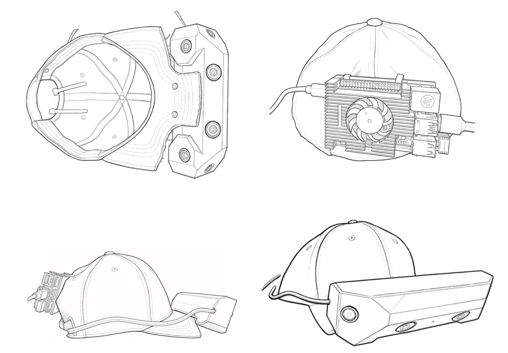
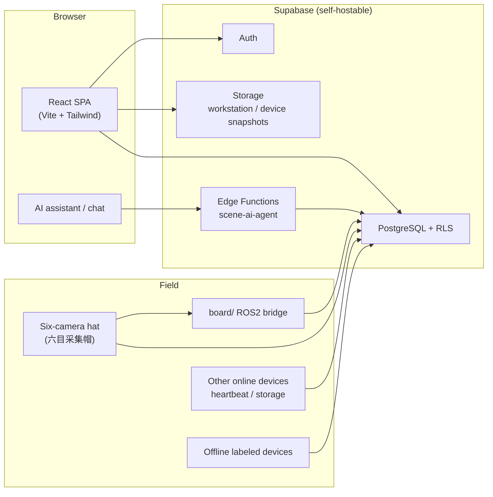

# upaieasy!

**Internal management for data-collection teams** — **豆小秘**, your built-in AI coworker, raises system **affordance**: ask in chat for navigation, form fill, and workflow help so anyone can pick up the platform with less training.

[](https://upaieasy.cn)
[](https://upaieasy.cn)
[](https://react.dev/)
[](https://www.typescriptlang.org/)
[](https://supabase.com/)
[](https://vite.dev/)
[](https://tailwindcss.com/)

> **Live site:** [https://upaieasy.cn](https://upaieasy.cn)  
> upaieasy! is a **data-collection internal management system** for devices, crews, schedules, and settlement. Its core differentiator is **豆小秘**—an AI teammate embedded in group chat: @ mention to get **where to click**, **forms filled for you**, and **role-aware workflow answers**. That lifts **affordance** across a deep admin UI and **lowers the barrier** for new operators, scene planners, and field executors. The repo also includes a **six-camera collection hat** that **connects online** via [`board/`](board/) firmware.

[中文版 README](README.zh-CN.md)

---

## Preview

<p align="center">
  <a href="https://upaieasy.cn"></a>
</p>

<p align="center"><sub>Admin dashboard — fleet, KPIs, and financial estimates; ask 豆小秘 when you need help finding a screen</sub></p>

<table>
  <tr>
    <td width="50%" align="center"><b>Sign-in · multi-role signup</b><br><sub>Group invite code · admin / ops / scene / executor</sub><br><br><a href="https://upaieasy.cn"></a></td>
    <td width="50%" align="center"><b>豆小秘 · AI coworker</b><br><sub>@ in group chat: navigate, fill forms, Q&amp;A by role</sub><br><br><a href="https://upaieasy.cn"></a></td>
  </tr>
  <tr>
    <td width="50%" align="center"><b>Device registration · QR labels</b><br><sub>Linked to client project, auto-generated IDs</sub><br><br><a href="https://upaieasy.cn"></a></td>
    <td width="50%" align="center"><b>Device cards · status</b><br><sub>Assign executors, scan info, fault / RMA</sub><br><br><a href="https://upaieasy.cn"></a></td>
  </tr>
</table>

<p align="center">
  
</p>

<p align="center"><sub>Six-camera collection hat — wearable multi-cam rig; design sketch (repo: <code>hardware/</code> + <code>board/</code>)</sub></p>

<p align="center">
  <a href="https://upaieasy.cn"><strong>→ Try it at upaieasy.cn</strong></a>
</p>

---

## Why upaieasy!

| Usability gap | How upaieasy! improves affordance |
|------|------------------|
| Many modules and menus—new users don’t know where to start | **豆小秘** in group chat: ask “what’s next?” and get **click paths** matched to your role |
| Long forms (projects, macro sites, shifts) are easy to get wrong | **豆小秘** infers context and **fills forms for you** from natural language |
| Training docs lag behind product changes | **豆小秘** answers **live workflow questions** with permissions aligned to your role |
| Devices and records scattered across Excel, chat, and paper labels | Unified online + offline registration with **QR labels** and one overview |
| Crew dispatch and shift coordination over separate sheets | **Macro site → micro position → collection shift**; publish once and auto-assign device IDs |
| Executors unsure which device or shift is theirs | Executors see **assigned devices and shifts only**; clock-in/out on site |

**Batteries included:** React SPA + Supabase (Postgres / Auth / RLS / Storage / Edge Functions)—no custom business API required.  
**Self-hostable:** Run Supabase on your own server (Docker on CVM); business and field data stay on your infrastructure.

---

## 豆小秘 · AI coworker

> The product’s **affordance layer**: turn “I don’t know this system” into a conversation.

- **In-group @ mention** — no separate bot app; works where teams already chat
- **Navigation** — “Where do I register a device?” → step-by-step, role-aware
- **Form fill** — describe intent in plain language; 豆小秘 drafts project, scene, and shift forms
- **Workflow Q&A** — onboarding, approvals, bounties, wallet rules—answered in context
- **Backend:** Supabase Edge Function `scene-ai-agent` (Volcengine Ark / Doubao) + frontend intent routing in [`frontend/src/aitebot/`](frontend/src/aitebot/)

---

## Features

> **Internal ops backbone** (devices, scenes, shifts, KPIs) + **豆小秘** so the same system stays approachable for every role.

### Device management
- **Online devices:** registration, heartbeat, calibration, firmware, notes; QR scan to identify — includes the **six-camera collection hat** when running [`board/`](board/) on-board code
- **Offline / external devices:** linked to a client project; **10-char hex registration ID** and printable QR label
- **Bulk assignment:** ops assigns idle devices to executors; executor overview shows **assigned devices only**

### Scenes & scheduling
- **Client projects** (admin): device type, snapshots, total hours, **approved hours per macro site**, settlement rate
- **Scene positions:** macro site (panorama + address/contacts) → micro position (workstation snapshot)
- **Collection shifts:** pick position + executors + device count → publish → auto-allocate offline device IDs → executor clock-in

### Collaboration & incentives
- **Work groups:** invite-code approval, multi-role members, in-group topics
- **Bounties:** admin publishes hour pools; executors claim tasks
- **Wallet & settlement:** executor ledger and points (backed by bounty / settlement RPCs)

### Admin console
- Role-based **KPIs** (device health / scene count / data volume) and review periods
- **Broadcast announcements**, **financial estimate board**

---

## Companion hardware · Six-camera hat

This repo ships alongside a **six-camera collection hat** (六目采集帽)—a wearable rig with a **six-lens front array** and an **on-board compute module** (LubanCat + ROS 2). After provisioning, it **connects online** to upaieasy! and reports **heartbeat, recording state, CPU load, and firmware** in the web console, while capturing video and optional IMU data.

| In this repo | Contents |
|--------------|----------|
| [`board/`](board/) | **On-board program** — ROS 2 Web Bridge: Supabase/API heartbeat, ffmpeg recording, optional MPU6050 gyro CSV. See [`board/README.md`](board/README.md). |
| [`hardware/`](hardware/) | **Partial open release** — incomplete BOM plus some **STL / STEP** enclosure and bracket models. **Full BOM, production files, and detailed mechanical/electrical docs are not open-sourced.** |
| [`show/6.png`](show/6.png) | **Design sketch** — front / side / top / rear views of the hat assembly |

---

## Multi-role, one team

Permissions are the **union** of `profiles.roles[]`; one person can hold several hats (e.g. ops + scene planner). **豆小秘** adapts answers to whichever roles you hold.

| Role | Typical access |
|------|----------|
| **Platform admin** | Console, groups, client projects, full device fleet, bounty publish, finance board |
| **Device operator** | Device overview / management, offline registration & assignment, ops workspace |
| **Scene planner** | Collection shifts, macro sites & micro positions |
| **Collection executor** | Shift clock-in, read-only assigned devices, bounties, wallet |

Full UI walkthrough (Chinese): **[User manual](docs/网页使用手册.md)**.

---

## Architecture



| Path | Description |
|------|------|
| [`frontend/`](frontend/) | **Main app:** React 19 + TypeScript + Tailwind 4 |
| [`supabase/functions/`](supabase/functions/) | Edge Functions (scene AI, etc.) |
| [`docs/`](docs/) | User & ops docs (mostly Chinese) |
| [`backend/`](backend/) | Optional FastAPI + CLI (USB provisioning) |
| [`board/`](board/) | **Six-camera hat on-board code** — ROS 2 → HTTPS heartbeat, recording, gyro sync |
| [`hardware/`](hardware/) | **Partial** mechanical models (STL/STEP); full BOM & production files not open |

---

## Quick start

### 1. Connect Supabase

Production runs on **self-hosted Supabase on CVM**. See **[Self-hosted Supabase guide](docs/自建Supabase服务器连接说明.md)** (API URL, `ANON_KEY`, do not point at Supabase Cloud).

### 2. Run the frontend

```bash
cd frontend
npm install
cp .env.example .env
# Set VITE_SUPABASE_URL and VITE_SUPABASE_ANON_KEY (anon key only; never commit service_role)
npm run dev
```

Open `http://localhost:5173`. Promote the first user to `admin` in `profiles`, or use the “platform admin” signup path (depends on your deployment policy).

### 3. Optional: Edge Function (AI assistant)

```bash
# See scripts/server/deploy_scene_ai_agent.sh; secrets in docs/自建Supabase服务器连接说明.md §6
bash scripts/server/deploy_scene_ai_agent.sh
```

### 4. Optional: six-camera hat / device CLI

**On-board (hat):** flash and run the ROS 2 bridge on LubanCat — [`board/README.md`](board/README.md).

```bash
cd backend
pip install -r requirements.txt
python cli.py provision --port /dev/ttyUSB0   # Linux; use COM port on Windows
```

---

## Documentation

| Doc | Audience | Contents |
|------|------|------|
| [User manual](docs/网页使用手册.md) | End users | Role- and page-level guide (Chinese) |
| [Self-hosted Supabase guide](docs/自建Supabase服务器连接说明.md) | Ops / dev | Production CVM, keys, Edge Functions |
| [board/README.md](board/README.md) | Embedded | Six-camera hat ROS 2 bridge & recording |

---

## Tech stack

- **Frontend:** React 19 · React Router 7 · TypeScript · Vite 7 · Tailwind CSS 4
- **Data layer:** Supabase (PostgREST · GoTrue · Row Level Security · Storage)
- **Maps:** Amap JS API (collection map; feature-flagged per environment)
- **AI:** Volcengine Ark / Doubao (configurable in Edge Function)
- **Devices:** Six-camera hat (ROS 2 / LubanCat) · Python FastAPI · USB provisioning CLI

---

## Development & testing

```bash
# Frontend
cd frontend && npm run build && npm run lint

# Backend (optional)
cd backend && python -m pytest tests/ -v

# Delivery smoke tests (on CVM)
bash scripts/server/delivery_test_verify.sh
bash scripts/server/run_delivery_test_rls.sh
```

---

## Project layout

```
upaiego-management/
├── frontend/                 # Web app (main entry)
│   ├── src/pages/            # Devices, scenes, shifts, admin, bounties…
│   ├── src/api/              # Supabase client wrappers
│   ├── src/aitebot/          # AI assistant context & form inference
│   └── edgeone.json          # Static hosting build config
├── supabase/functions/       # Edge Functions
├── docs/                     # User & ops documentation
├── backend/                  # FastAPI + CLI (optional)
├── board/ros2_web_bridge/    # Six-camera hat on-board ROS 2 program
├── hardware/                 # Partial STL/STEP models (full BOM not open)
└── scripts/server/           # Deploy & acceptance scripts
```

---

## About

**upaieasy!** is a **data-collection internal management system** whose standout feature is **豆小秘**—raising **affordance** so teams spend less time learning menus and more time on smart-manufacturing field delivery.

**Website:** [https://upaieasy.cn](https://upaieasy.cn)

---

<p align="center">
  <sub>If 豆小秘 and low-friction ops help your team, consider starring ⭐ and sharing upaieasy!</sub>
</p>
