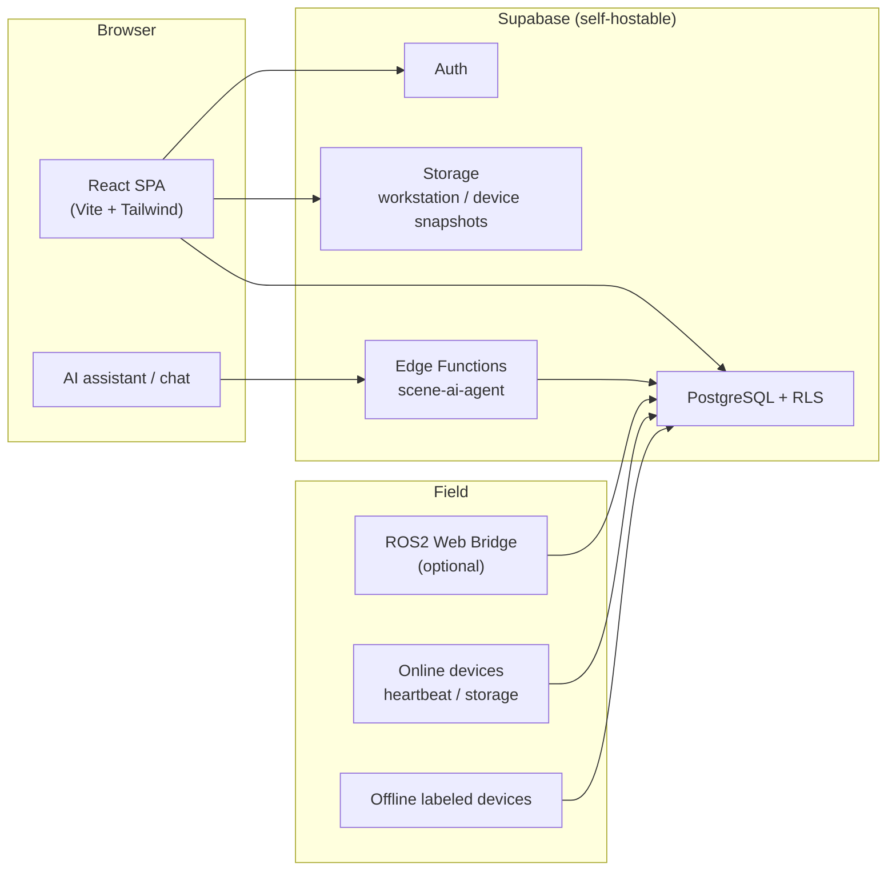

# upaieasy!

**Internal ops platform for data-collection contractors** — manage multiple client projects, devices, crews, schedules, and costs in one place. Cut coordination overhead and deliver smarter manufacturing field ops.

[](https://upaieasy.cn)
[](https://react.dev/)
[](https://www.typescriptlang.org/)
[](https://supabase.com/)
[](https://vite.dev/)
[](https://tailwindcss.com/)

> **Live site:** [https://upaieasy.cn](https://upaieasy.cn)  
> Built for **data-collection companies running several client (甲方) projects at once**. Work groups isolate each client’s ops; device labeling, field scheduling, clock-in/out, and labor settlement sit on one internal workflow—**replacing spreadsheets, chat threads, and manual reconciliation** so smart-manufacturing collection sites stay controllable and cost-transparent.

[中文版 README](README.zh-CN.md)

---

## Preview

<p align="center">
  <a href="https://upaieasy.cn"></a>
</p>

<p align="center"><sub>Admin dashboard — client projects, fleet size, and financial estimates at a glance</sub></p>

<table>
  <tr>
    <td width="50%" align="center"><b>Sign-in · multi-role signup</b><br><sub>Group invite code · admin / ops / scene / executor</sub><br><br><a href="https://upaieasy.cn"></a></td>
    <td width="50%" align="center"><b>Groups · AI assistant</b><br><sub>@ bot for navigation, form fill, workflow Q&amp;A</sub><br><br><a href="https://upaieasy.cn"></a></td>
  </tr>
  <tr>
    <td width="50%" align="center"><b>Device registration · QR labels</b><br><sub>Linked to client project, auto-generated IDs</sub><br><br><a href="https://upaieasy.cn"></a></td>
    <td width="50%" align="center"><b>Device cards · status</b><br><sub>Assign executors, scan info, fault / RMA</sub><br><br><a href="https://upaieasy.cn"></a></td>
  </tr>
</table>

<p align="center">
  <a href="https://upaieasy.cn"><strong>→ Try it at upaieasy.cn</strong></a>
</p>

---

## Why upaieasy!

| Pain for collection contractors | How upaieasy! helps |
|------|------------------|
| Multiple client projects in parallel; devices and records scattered across Excel, chat, and paper labels | **Work groups per client**; online + offline devices registered in one place with **QR labels** and a single overview |
| Scenes, schedules, and crew dispatch on separate sheets—high coordination cost | Clear **macro site → micro position → collection shift** hierarchy; publish once and auto-assign device IDs |
| Executors unsure where to go or which device to use—idle time on site | Executors see **only assigned devices** and shifts; clock-in/out reduces dispatch errors |
| Hard to track revenue, cost, and margin across parallel clients | Admin **KPI + financial estimates** (client rate × hours − executor cost), split by client |
| Onboarding and form entry eat management time | In-group **AI assistant (豆小秘)** fills client projects, macro sites, shifts, etc.—less training and fewer mistakes |

**Batteries included:** React SPA + Supabase (Postgres / Auth / RLS / Storage / Edge Functions)—no custom business API required.  
**Self-hostable:** Run Supabase on your own server (Docker on CVM); client and field data stay on your infrastructure.

---

## Features

> Designed around **parallel client projects → unified internal dispatch → costs you can calculate**.

### Device management
- **Online devices:** registration, heartbeat, calibration, firmware, notes; QR scan to identify
- **Offline / external devices:** linked to a client project; **10-char hex registration ID** and printable QR label
- **Bulk assignment:** ops assigns idle devices to executors; executor overview shows **assigned devices only**

### Scenes & scheduling
- **Client projects** (admin): device type, snapshots, total hours, **approved hours per macro site**, settlement rate
- **Scene positions:** macro site (panorama + address/contacts) → micro position (workstation snapshot)
- **Collection shifts:** pick position + executors + device count → publish → auto-allocate offline device IDs → executor clock-in

### Collaboration & incentives
- **Work groups:** invite-code approval, multi-role members, in-group topics
- **Bounties:** admin publishes hour pools; executors claim tasks
- **Wallet & settlement:** executor ledger and points (backed by bounty / settlement RPCs)

### Admin console
- Role-based **KPIs** (device health / scene count / data volume) and review periods
- **Broadcast announcements**, **financial estimate board** (by client)

### AI assistant
- Supabase Edge Function `scene-ai-agent` + frontend **豆小秘**
- @ mention in group chat: navigation, form fill, workflow Q&A (aligned with roles and permissions)

---

## Multi-role, one contractor org

Permissions are the **union** of `profiles.roles[]`; one person can hold several hats (e.g. ops + scene planner), matching flexible crews and parallel projects.

| Role | Typical access |
|------|----------|
| **Platform admin** | Console, groups, client projects, full device fleet, bounty publish, finance board |
| **Device operator** | Device overview / management, offline registration & assignment, ops workspace |
| **Scene planner** | Collection shifts, macro sites & micro positions |
| **Collection executor** | Shift clock-in, read-only assigned devices, bounties, wallet |

Full UI walkthrough (Chinese): **[User manual](docs/网页使用手册.md)**.

---

## Architecture



| Path | Description |
|------|------|
| [`frontend/`](frontend/) | **Main app:** React 19 + TypeScript + Tailwind 4 |
| [`supabase/functions/`](supabase/functions/) | Edge Functions (scene AI, etc.) |
| [`docs/`](docs/) | User & ops docs (mostly Chinese) |
| [`backend/`](backend/) | Optional FastAPI + CLI (USB provisioning) |
| [`board/`](board/) | Optional ROS 2 → HTTPS heartbeat bridge |

---

## Quick start

### 1. Connect Supabase

Production runs on **self-hosted Supabase on CVM**. See **[Self-hosted Supabase guide](docs/自建Supabase服务器连接说明.md)** (API URL, `ANON_KEY`, do not point at Supabase Cloud).

### 2. Run the frontend

```bash
cd frontend
npm install
cp .env.example .env
# Set VITE_SUPABASE_URL and VITE_SUPABASE_ANON_KEY (anon key only; never commit service_role)
npm run dev
```

Open `http://localhost:5173`. Promote the first user to `admin` in `profiles`, or use the “platform admin” signup path (depends on your deployment policy).

### 3. Optional: Edge Function (AI assistant)

```bash
# See scripts/server/deploy_scene_ai_agent.sh; secrets in docs/自建Supabase服务器连接说明.md §6
bash scripts/server/deploy_scene_ai_agent.sh
```

### 4. Optional: device CLI / board

```bash
cd backend
pip install -r requirements.txt
python cli.py provision --port /dev/ttyUSB0   # Linux; use COM port on Windows
```

Board-side ROS 2 bridge: [`board/README.md`](board/README.md).

---

## Documentation

| Doc | Audience | Contents |
|------|------|------|
| [User manual](docs/网页使用手册.md) | End users | Role- and page-level guide (Chinese) |
| [Self-hosted Supabase guide](docs/自建Supabase服务器连接说明.md) | Ops / dev | Production CVM, keys, Edge Functions |
| [board/README.md](board/README.md) | Embedded | ROS 2 Web Bridge heartbeat |

---

## Tech stack

- **Frontend:** React 19 · React Router 7 · TypeScript · Vite 7 · Tailwind CSS 4
- **Data layer:** Supabase (PostgREST · GoTrue · Row Level Security · Storage)
- **Maps:** Amap JS API (collection map; feature-flagged per environment)
- **AI:** Volcengine Ark / Doubao (configurable in Edge Function)
- **Devices:** Python FastAPI · ROS 2 Web Bridge · USB serial provisioning CLI

---

## Development & testing

```bash
# Frontend
cd frontend && npm run build && npm run lint

# Backend (optional)
cd backend && python -m pytest tests/ -v

# Delivery smoke tests (on CVM)
bash scripts/server/delivery_test_verify.sh
bash scripts/server/run_delivery_test_rls.sh
```

---

## Project layout

```
upaiego-management/
├── frontend/                 # Web app (main entry)
│   ├── src/pages/            # Devices, scenes, shifts, admin, bounties…
│   ├── src/api/              # Supabase client wrappers
│   ├── src/aitebot/          # AI assistant context & form inference
│   └── edgeone.json          # Static hosting build config
├── supabase/functions/       # Edge Functions
├── docs/                     # User & ops documentation
├── backend/                  # FastAPI + CLI (optional)
├── board/ros2_web_bridge/    # Board heartbeat (optional)
└── scripts/server/           # Deploy & acceptance scripts
```

---

## About

**upaieasy!** helps companies that **take on multiple client data-collection projects** run **internal ops and cost control**—less coordination waste on smart-manufacturing sites, clearer ROI per project.

**Website:** [https://upaieasy.cn](https://upaieasy.cn)

---

<p align="center">
  <sub>If this project helps your team, consider starring ⭐ and sharing it with others running multi-client collection ops.</sub>
</p>
