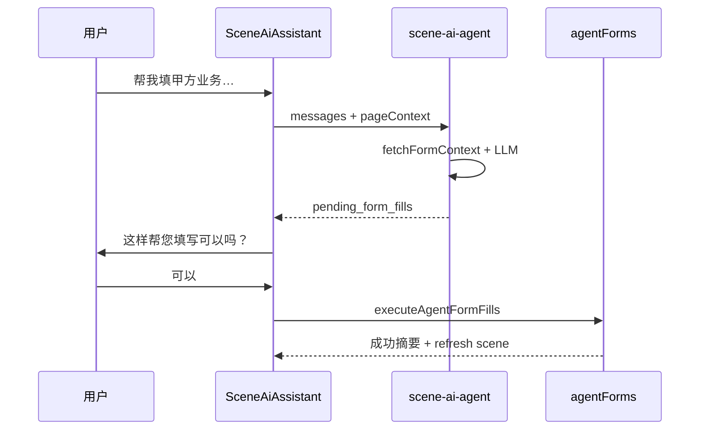

# 豆小秘代填表单目录

豆小秘通过对话解析用户意图，输出 `form_fills`；用户在聊天里点 **可以** 后，前端调用 `frontend/src/api/agentForms.ts` 写入数据库。

## 流程

## 表单类型与权限

| form | 角色 | 说明 |
|------|------|------|
| `party_demand_create` | admin, scene_operator | 创建甲方业务（占位设备图） |
| `party_demand_update` | admin, scene_operator | 更新甲方业务，需 `target_id` |
| `scene_macro_create` | admin, scene_operator | 创建大场景（占位全景图） |
| `scene_macro_update` | admin, scene_operator | 更新大场景 |
| `scenario_position_create` | admin, scene_operator | 创建小岗位（占位工位图） |
| `scenario_position_update` | admin, scene_operator | 更新小岗位 |
| `group_topic_create` | 全员 active | 发布群话题 |
| `manual_device_create` | admin, device_operator | 登记离线设备 |
| `collection_shift_create` | admin, scene_operator | 采集排班（可 `publish: true`） |
| `profile_update` | 全员 | 更新当前用户资料 |
| `bounty_publish` | admin | 发布悬赏令 |
| `device_register` | admin, device_operator | 登记联网设备 |

字段明细见 `supabase/functions/scene-ai-agent/formCatalog.ts`。

## 相关文件

- Edge prompt：`supabase/functions/scene-ai-agent/formCatalog.ts`
- 执行器：`frontend/src/api/agentForms.ts`
- 类型：`frontend/src/aitebot/agentFormTypes.ts`
- Cursor Skill：`.cursor/skills/dou-xiaomi-form-fill/SKILL.md`
